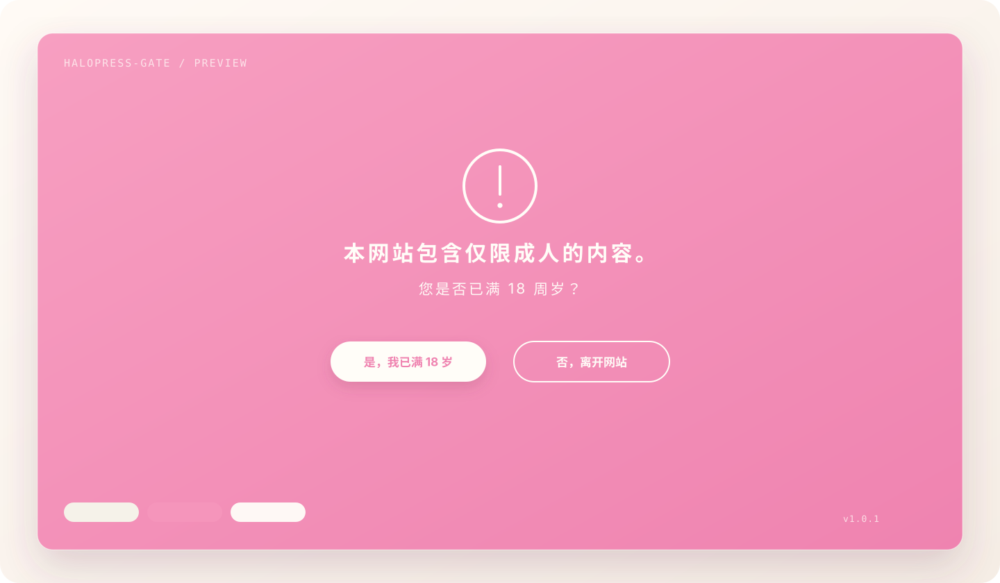

<div align="center">

# HaloPress-Gate

一款轻量、可配置的 WordPress 内容确认与开场动画插件。

[](https://wordpress.org/)
[](https://www.php.net/)
[](LICENSE)

</div>



HaloPress-Gate 会在网站内容出现前展示一个全屏确认界面。页面资源加载完成后，访客可以确认年龄或内容访问条件；确认文字淡出，双色幕布依次向上收起，随后无缝进入网站正文。

## 特性

- 图片预加载进度驱动开场动画，并设置最长等待时间，避免坏图阻塞页面。
- 在 WordPress 后台配置标题、提示语、按钮文字、离开网址、图标和配色。
- 使用 Cookie 记住确认结果，记忆时间可设为 1–365 天。
- 可让已确认的回访者仅播放开场动画，不重复显示确认问题。
- 支持键盘焦点循环、语义化对话框和 `prefers-reduced-motion`。
- 不依赖 jQuery、GSAP 或其他第三方前端运行库。
- 提供 PHP 过滤器、浏览器事件和页面状态类，便于与主题动画衔接。
- 对页面缓存友好：确认状态由浏览器端判断。

## 动画流程

```text
页面开始加载
    ↓
彩色层随图片加载进度展开
    ↓
显示内容确认界面
    ↓
确认文字向右淡出
    ↓
彩色层收起 → 底色层延迟收起
    ↓
显示页面并触发 acg:entered
```

## 安装

### 使用 ZIP 安装

1. 下载项目发布页中的 `halopress-gate.zip`。
2. 在 WordPress 后台打开“插件 → 安装插件 → 上传插件”。
3. 上传 ZIP、完成安装并启用 **HaloPress-Gate**。
4. 前往“设置 → 内容确认动画”进行配置。

### 手动安装

将项目文件复制到：

```text
wp-content/plugins/halopress-gate/
```

然后在 WordPress 插件页面启用 **HaloPress-Gate**。

## 后台配置

| 设置项 | 说明 |
| --- | --- |
| 启用插件 | 控制前台确认层是否启用 |
| 提示标题与确认问题 | 自定义访客看到的内容 |
| 确认与离开按钮 | 自定义按钮文字及离开后的网址 |
| 自定义图标 | 可填写站内或外部图片网址，留空使用内置线框图标 |
| 三组颜色 | 分别控制底层、动画层和文字颜色 |
| 确认记忆天数 | Cookie 有效期，范围为 1–365 天 |
| 回访动画 | 已确认访客是否仍播放幕布动画 |

设置页提供“强制预览确认层”按钮，不清理 Cookie 也能检查最新样式。

## 与主题集成

### 控制显示范围

插件默认作用于整个网站前台。使用 `acg_should_show_gate` 过滤器可限定页面，例如只在首页显示：

```php
add_filter( 'acg_should_show_gate', function () {
    return is_front_page();
} );
```

### 在退场后启动主题动画

确认层关闭后，插件会：

- 向 `html` 和 `body` 添加 `acg-entered` 类。
- 在 `window` 上触发 `acg:entered` 事件。

```js
window.addEventListener('acg:entered', function () {
    document.querySelector('.hero')?.classList.add('hero--start');
});
```

```css
.hero {
    opacity: 0;
    transform: translateY(20px);
}

.acg-entered .hero {
    opacity: 1;
    transform: none;
    transition: opacity .6s ease, transform .6s ease;
}
```

## 技术信息

- WordPress：6.0 或更高版本
- PHP：7.4 或更高版本
- JavaScript：原生浏览器 API，无运行时依赖
- Cookie：`acg_age_confirmed=yes`
- 版本：1.0.0

## 项目结构

```text
halopress-gate/
├── assets/
│   ├── css/content-gate.css
│   └── js/content-gate.js
├── docs/preview.svg
├── halopress-gate.php
├── LICENSE
├── README.md
└── readme.txt
```

## 许可证

HaloPress-Gate 使用 [GNU General Public License v3.0 or later](LICENSE) 发布。
